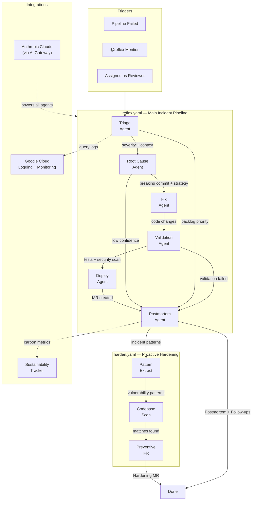

# Reflex

### Autonomous Incident-to-Fix Pipeline for GitLab

> A production alert fires. Today, a human triages, finds root cause, writes a fix, adds tests, creates a merge request, and writes a postmortem. That takes **hours to days**. Reflex does it in **minutes**.

---

## The Problem

Incident response is the most expensive, stressful, and error-prone part of the software development lifecycle. When a pipeline fails or production breaks:

- **Mean Time to Resolution (MTTR)** averages 2-4 hours for most teams
- Engineers context-switch away from feature work, destroying productivity
- Root cause analysis is manual, repetitive, and often incomplete
- Postmortems are skipped or rushed, so the same bugs recur
- The human cost: stress, burnout, on-call fatigue

**What if your repository could heal itself?**

## The Solution

Reflex is a **self-healing immune system** for GitLab repositories. It's an orchestrated flow of 6 specialized AI agents that work together to autonomously handle the entire incident lifecycle:

```
Pipeline Failure / Incident Detected
            │
            ▼
    ┌───────────────┐
    │  TRIAGE AGENT  │  Classify severity, identify blast radius,
    │                │  gather context from logs & code
    └───────┬───────┘
            │
            ▼
    ┌───────────────┐
    │  ROOT CAUSE   │  Git archaeology — trace the exact commit,
    │    AGENT      │  file, and line that broke things
    └───────┬───────┘
            │
            ▼
    ┌───────────────┐
    │   FIX AGENT   │  Generate a minimal, targeted fix
    │               │  following existing code patterns
    └───────┬───────┘
            │
            ▼
    ┌───────────────┐
    │  VALIDATION   │  Write regression tests, run security
    │    AGENT      │  scans, verify fix safety
    └───────┬───────┘
            │
            ▼
    ┌───────────────┐
    │  DEPLOY AGENT │  Create MR with fix + tests,
    │               │  monitor pipeline, prep for merge
    └───────┬───────┘
            │
            ▼
    ┌───────────────┐
    │  POSTMORTEM   │  Blameless report, follow-up issues,
    │    AGENT      │  sustainability metrics
    └───────┬───────┘
            │
            ▼
    ┌───────────────┐
    │   HARDEN      │  Scan codebase for similar patterns,
    │    FLOW       │  create preventive MRs
    └───────────────┘
```

## How It Works

### Triggers
Reflex activates automatically when:
- **Pipeline fails** — Pipeline failure events trigger the flow
- **Incident created** — Mention `@reflex` on an issue to engage
- **Manual invoke** — Assign `@reflex` as a reviewer or use `/reflex-triage`

### The Six-Agent Pipeline

| Agent | Role | Tools Used |
|-------|------|-----------|
| **Triage** | First responder — classifies severity, identifies affected services, gathers diagnostic context | `get_issue`, `blob_search`, `read_file`, `create_issue_note` |
| **Root Cause** | Detective — traces git history, analyzes code changes, pinpoints the exact breaking commit | `read_file`, `blob_search`, `get_repository_file`, `list_repository_tree` |
| **Fix** | Surgeon — generates minimal, safe, pattern-consistent code fixes | `read_file`, `edit_file`, `create_file_with_contents` |
| **Validation** | QA + Security — writes regression tests and scans for vulnerabilities | `read_file`, `create_file_with_contents`, `blob_search` |
| **Deploy** | DevOps — creates MR, commits changes, monitors pipeline | `create_commit`, `create_merge_request`, `create_issue_note` |
| **Postmortem** | Analyst — blameless report, timeline, follow-ups, sustainability metrics | `get_issue`, `create_issue_note`, `create_file_with_contents` |

### Smart Routing
The flow isn't just linear — it has **conditional routing**:
- Low-priority or backlog items skip straight to postmortem (documenting for later)
- Low-confidence root causes skip the fix and flag for human investigation
- Failed validation skips deployment and reports issues in the postmortem

### Proactive Hardening
After every incident, the **Harden Flow** activates:
1. **Pattern Extraction** — Generalizes the specific bug into abstract vulnerability patterns
2. **Codebase Scan** — Searches the entire repo for similar patterns
3. **Preventive Fix** — Creates a hardening MR fixing all instances before they become incidents

This means Reflex doesn't just fix bugs — it **makes your codebase more resilient over time**.

## Architecture



```
┌──────────────────────────────────────────────────────────────┐
│                    GitLab Duo Agent Platform                  │
│                                                              │
│  ┌─────────┐    ┌──────────────────────────────────────┐    │
│  │ Triggers │───▶│         reflex.yaml (Flow)           │    │
│  │          │    │                                      │    │
│  │ Pipeline │    │  Triage ──▶ Root Cause ──▶ Fix ──▶  │    │
│  │ Mention  │    │  Validation ──▶ Deploy ──▶ Postmortem│    │
│  │ Assign   │    └──────────────┬───────────────────────┘    │
│  └─────────┘                    │                            │
│                                 ▼                            │
│                    ┌──────────────────────┐                  │
│                    │   harden.yaml (Flow) │                  │
│                    │                      │                  │
│                    │ Extract ──▶ Scan ──▶ │                  │
│                    │ Preventive Fix       │                  │
│                    └──────────────────────┘                  │
│                                                              │
│  ┌─────────────────────┐  ┌─────────────────────────────┐  │
│  │  Anthropic Claude   │  │  Google Cloud Integration   │  │
│  │  (via AI Gateway)   │  │  - Cloud Logging            │  │
│  │                     │  │  - Cloud Monitoring          │  │
│  └─────────────────────┘  └─────────────────────────────┘  │
│                                                              │
│  ┌──────────────────────────────────────────────────────┐   │
│  │            Sustainability Tracker                     │   │
│  │  Token usage • Compute time • Carbon footprint       │   │
│  └──────────────────────────────────────────────────────┘   │
└──────────────────────────────────────────────────────────────┘
```

## Google Cloud Integration

Reflex integrates with Google Cloud for enhanced incident diagnostics:

- **Cloud Logging** — Queries application and infrastructure logs for error context, stack traces, and correlated events around the incident timestamp
- **Cloud Monitoring** — Checks for anomalies in error rates, latency, and resource utilization that correlate with the incident

This gives agents richer context than pipeline logs alone, enabling faster and more accurate root cause analysis.

## Sustainability (Green Agent)

Every Reflex run tracks its environmental impact:

| Metric | Manual Response | Reflex |
|--------|----------------|--------|
| Time | 2-4 hours | 5-15 minutes |
| Human compute hours | 2-8 person-hours | 0 |
| Estimated CO2 | ~500-1000g* | ~5-15g |

*Based on average laptop energy consumption + video conferencing + infrastructure idle time during manual incident response.

Reflex generates a sustainability report with every postmortem, showing:
- Total agent steps and token usage
- Estimated compute energy consumption
- Carbon savings vs. manual incident response
- Cumulative sustainability impact over time

## Quick Start

### Prerequisites
- GitLab Premium/Ultimate with Duo Pro or Enterprise subscription
- Access to the GitLab AI Hackathon sandbox (or your own instance)
- (Optional) Google Cloud project for enhanced logging integration

### Setup

1. **Clone this project** into your GitLab group
2. **Configure triggers** in Automate > Triggers:
   - Add pipeline failure trigger → point to `.gitlab/duo/flows/reflex.yaml`
   - Add mention trigger → point to `.gitlab/duo/flows/reflex.yaml`
3. **Set CI/CD variables** (optional, for GCP integration):
   - `GOOGLE_CREDENTIALS` — GCP service account JSON
   - `GOOGLE_CLOUD_PROJECT` — Your GCP project ID
4. **Test it** — Push a breaking change and watch Reflex respond

### Using Skills Individually

Each agent is also available as a standalone skill:
- `/reflex-triage` — Run triage on any issue
- `/reflex-root-cause` — Analyze root cause of a failure
- `/reflex-fix` — Generate a fix for a known issue
- `/reflex-validate` — Run validation on pending changes
- `/reflex-deploy` — Create a deployment MR
- `/reflex-postmortem` — Generate a postmortem report
- `/reflex-harden` — Scan for vulnerability patterns

## Demo

See the [demo scenario](src/demo/) for a walkthrough of Reflex in action:

1. A developer pushes an "optimization" to the user service
2. The optimization has a subtle bug: it crashes when the database returns empty results
3. The CI pipeline fails on the test stage
4. Reflex automatically triggers and runs through all 6 agents
5. A merge request appears with the fix, regression tests, and full postmortem
6. The Harden flow scans for similar patterns and creates a preventive MR

## Project Structure

```
reflex/
├── .gitlab/
│   └── duo/
│       ├── agent-config.yml              # Runtime environment config
│       └── flows/
│           ├── reflex.yaml               # Main 6-agent incident pipeline
│           └── harden.yaml               # Proactive hardening flow
├── skills/
│   ├── triage/SKILL.md                   # Incident triage skill
│   ├── root-cause/SKILL.md              # Root cause analysis skill
│   ├── fix/SKILL.md                     # Code fix generation skill
│   ├── validation/SKILL.md             # Test + security validation skill
│   ├── deploy/SKILL.md                 # MR creation + deploy skill
│   ├── postmortem/SKILL.md            # Postmortem generation skill
│   └── harden/SKILL.md               # Proactive hardening skill
├── src/
│   ├── gcp/                           # Google Cloud integration
│   │   ├── cloud_logging.py          # Cloud Logging queries
│   │   └── monitoring.py             # Cloud Monitoring queries
│   ├── utils/
│   │   ├── sustainability.py         # Carbon/energy tracking
│   │   └── report_generator.py       # Postmortem report templates
│   └── demo/                         # Demo scenario
│       ├── app.py                    # Sample Flask app with bug
│       ├── .gitlab-ci.yml           # CI pipeline that fails
│       └── tests/test_app.py        # Tests that catch the bug
├── tests/
│   └── e2e/                          # Playwright E2E tests
├── AGENTS.md                         # Agent platform context
├── LICENSE                           # MIT License
├── README.md                         # This file
└── requirements.txt                  # Python dependencies
```

## Prize Categories Targeted

| Category | How Reflex Qualifies |
|----------|---------------------|
| **Grand Prize** | End-to-end autonomous incident response — most ambitious multi-agent flow |
| **Most Technically Impressive** | 9-agent orchestration across 2 flows with conditional routing and structured data passing |
| **Most Impactful** | Reduces MTTR from hours to minutes, prevents recurring incidents |
| **Easiest to Use** | Zero-config trigger — just enable and forget |
| **Anthropic** | All agents powered by Claude via GitLab AI Gateway |
| **Google Cloud** | Cloud Logging + Monitoring integration for incident diagnostics |
| **Green Agent** | Full sustainability tracking and carbon impact reporting |

## License

MIT — see [LICENSE](LICENSE)
