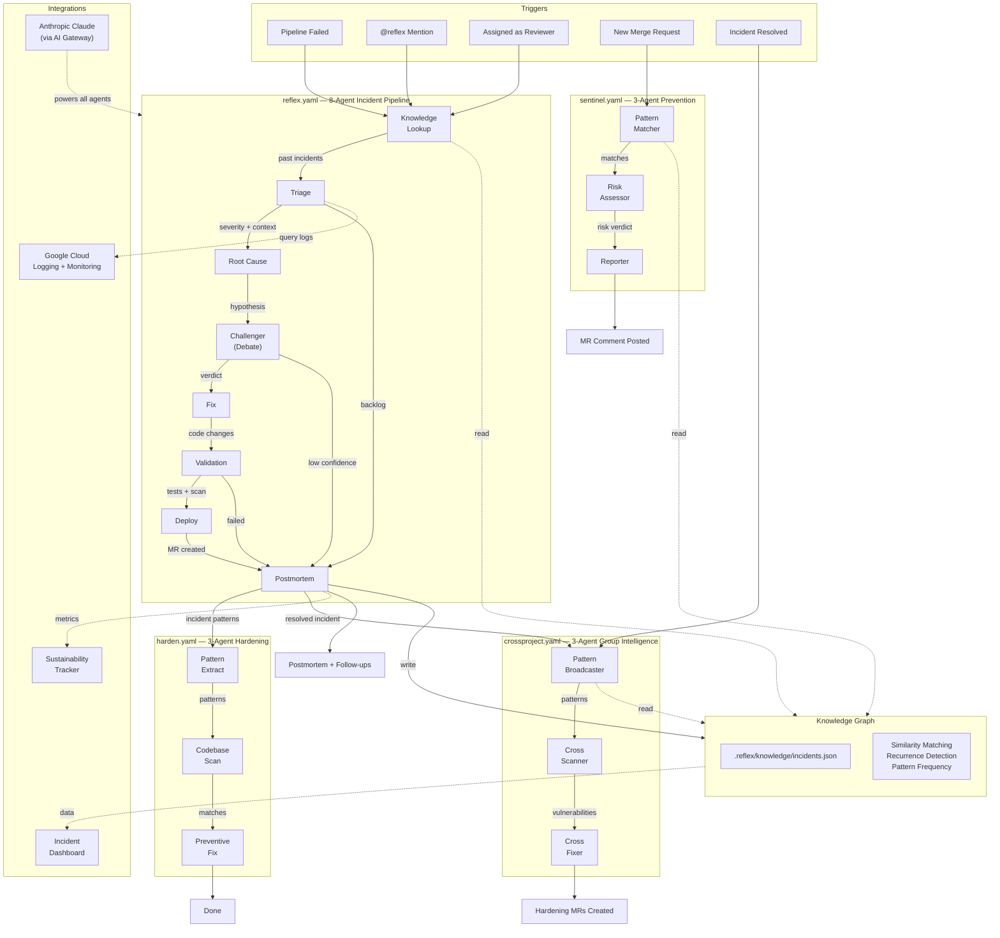

# Reflex

### An Adaptive Immune System for GitLab Repositories

> I was on-call at 2 AM when a deploy broke production. Three engineers spent four hours on a video call triaging, blaming, debugging, and hotfixing something that turned out to be a single null check. The postmortem never got written. The same pattern broke production again two months later.
>
> That night I thought: **what if every repository had an immune system that learns?**

Reflex is not a chatbot. It is not a linear pipeline. It is an **adaptive, learning immune system** that gets smarter with every incident it resolves. 17 specialized agents across 4 orchestrated flows detect, debate, fix, prevent, and remember — so the same failure never happens twice.

---

## What Makes Reflex Different

### 1. Knowledge Graph — Persistent Organizational Memory

Every incident Reflex resolves is distilled into a structured node in the knowledge graph at `.reflex/knowledge/incidents.json`. Root cause, fix strategy, affected files, pattern signatures, resolution time, sustainability metrics — all committed to the repo, versioned in Git, and code-reviewable.

When the next incident arrives, Reflex searches its memory **before** a single agent runs. If it has seen this pattern before — or anything like it — the entire pipeline knows immediately. Similarity matching, recurrence detection, and pattern frequency analysis turn raw incident data into organizational intelligence.

**The knowledge graph is the difference between a tool that runs and a system that learns.**

### 2. Debate Protocol — Adversarial Root Cause Verification

Most AI pipelines are linear: one agent produces an answer and the next agent trusts it. Reflex does not work this way.

After the Root Cause Agent proposes a hypothesis, the **Challenger Agent** attacks it. It reads the same code independently. It searches for counter-evidence. It asks: could the error come from a different source? Does the proposed failure mechanism explain all the symptoms? Are there files the Root Cause Agent missed?

The Challenger issues one of three verdicts:
- **Confirmed** — the hypothesis holds. Evidence is solid.
- **Refined** — mostly right, but adjusted with new evidence.
- **Rejected** — wrong diagnosis. The Challenger presents an alternative.

Only after the debate converges does the Fix Agent receive the root cause. This catches wrong diagnoses **before** bad fixes are applied.

### 3. Predictive Prevention (Sentinel Flow)

Reflex does not just react to incidents. It **prevents** them.

The Sentinel flow triggers on every new merge request. It scans the diff against the knowledge graph, comparing incoming code against every pattern that previously caused a failure. When it finds a match — a null check omission that mirrors a past outage, an unvalidated input that resembles a past security incident — it warns the developer with full context from organizational memory before the code ever merges.

Risk scores. Pattern tables. Past incident references. Blocking on critical matches. All automatic.

### 4. Cross-Project Intelligence

Vulnerabilities do not stop at project boundaries. The same anti-pattern — a missing null check, an unvalidated input, a race condition in an async handler — likely exists in sibling projects built by the same team, using the same libraries, following the same conventions.

When Reflex resolves an incident in one project, the CrossProject flow broadcasts the vulnerability pattern across the **entire GitLab group**. It scans sibling projects for the same weakness and creates hardening merge requests to fix them before they become incidents of their own.

**One incident, resolved everywhere.**

### 5. Carbon-Aware Scheduling

Every Reflex run tracks its environmental impact: agent steps, token usage, compute energy, and carbon emissions. Non-urgent tasks — hardening scans, cross-project sweeps, preventive MRs — defer to low-carbon grid hours.

Each postmortem includes a sustainability report comparing Reflex's footprint against the estimated cost of human incident response (laptops, video calls, infrastructure idle time).

### 6. Incident Dashboard

A GitLab Pages-ready visualization of the knowledge graph. Pattern heat maps showing which vulnerability categories recur most. MTTR trend lines tracking resolution speed over time. Severity breakdowns. Sustainability metrics. All rendered from the same `.reflex/knowledge/incidents.json` that powers the agents.

The dashboard turns organizational memory into something the whole team can see at a glance.

---

## How It Works

```
     New Incident Detected
              │
              ▼
  ┌───────────────────────┐
  │   KNOWLEDGE LOOKUP    │  Search organizational memory for
  │                       │  similar past incidents and patterns
  └───────────┬───────────┘
              │
              ▼
  ┌───────────────────────┐
  │      TRIAGE           │  Classify severity with knowledge
  │                       │  graph context, identify blast radius
  └───────────┬───────────┘
              │
       ┌──────┴──────┐
       │  immediate/  │  backlog ──────────────────┐
       │  next_cycle  │                             │
       └──────┬──────┘                             │
              ▼                                     │
  ┌───────────────────────┐                        │
  │     ROOT CAUSE        │  Propose hypothesis     │
  │                       │  with evidence           │
  └───────────┬───────────┘                        │
              │                                     │
              ▼                                     │
  ┌───────────────────────┐                        │
  │     CHALLENGER        │  Attack the hypothesis, │
  │   (Debate Protocol)   │  verify independently   │
  └───────────┬───────────┘                        │
              │                                     │
       ┌──────┴──────┐                             │
       │ high/medium  │  low confidence ────────────┤
       │ confidence   │                             │
       └──────┬──────┘                             │
              ▼                                     │
  ┌───────────────────────┐                        │
  │        FIX            │  Minimal, debate-       │
  │                       │  informed code fix       │
  └───────────┬───────────┘                        │
              │                                     │
              ▼                                     │
  ┌───────────────────────┐                        │
  │     VALIDATION        │  Regression tests,      │
  │                       │  security scan           │
  └───────────┬───────────┘                        │
              │                                     │
       ┌──────┴──────┐                             │
       │   passed     │  failed ───────────────────┤
       └──────┬──────┘                             │
              ▼                                     │
  ┌───────────────────────┐                        │
  │       DEPLOY          │  Create MR with fix     │
  │                       │  + tests + context       │
  └───────────┬───────────┘                        │
              │                                     │
              ▼                                     │
  ┌───────────────────────┐◄───────────────────────┘
  │     POSTMORTEM        │  Blameless report, knowledge
  │                       │  graph update, sustainability
  └───────────┬───────────┘
              │
              ▼
     ┌────────┴────────┐
     │  Harden Flow    │  Scan codebase for similar patterns
     │  Sentinel Flow  │  Update predictive prevention
     │  CrossProject   │  Broadcast to sibling projects
     └─────────────────┘
```

---

## The Four Flows

Reflex operates as **17 specialized agents** organized across **4 orchestrated flows**.

### Flow 1: `reflex.yaml` — Main Incident Pipeline (8 agents)

The core immune response. Detects, diagnoses, debates, fixes, validates, deploys, and learns.

| Agent | Role |
|-------|------|
| **Knowledge Lookup** | Searches organizational memory for similar past incidents |
| **Triage** | Classifies severity with knowledge graph context |
| **Root Cause** | Proposes root cause hypothesis with evidence |
| **Challenger** | Adversarial verification through the debate protocol |
| **Fix** | Generates minimal, debate-informed code fix |
| **Validation** | Writes regression tests and runs security scans |
| **Deploy** | Creates merge request with full incident context |
| **Postmortem** | Blameless report, knowledge graph update, sustainability metrics |

### Flow 2: `harden.yaml` — Proactive Hardening (3 agents)

After every incident, generalizes the vulnerability and sweeps the codebase for similar patterns.

| Agent | Role |
|-------|------|
| **Pattern Extract** | Generalizes the specific bug into abstract vulnerability patterns |
| **Codebase Scan** | Searches the entire repo using extracted patterns |
| **Preventive Fix** | Creates a hardening MR fixing all instances before they become incidents |

### Flow 3: `sentinel.yaml` — Predictive Prevention (3 agents)

Runs on every new merge request. The antibody layer.

| Agent | Role |
|-------|------|
| **Pattern Matcher** | Scans MR diff against the knowledge graph for known incident signatures |
| **Risk Assessor** | Aggregates findings into an overall risk verdict with blocking criteria |
| **Reporter** | Posts clear, evidence-based warnings on the MR with past incident context |

### Flow 4: `crossproject.yaml` — Group-Level Intelligence (3 agents)

Extends protection across the entire GitLab group. One incident resolved everywhere.

| Agent | Role |
|-------|------|
| **Pattern Broadcaster** | Extracts vulnerability pattern and identifies target sibling projects |
| **Cross Scanner** | Scans sibling projects for the same weakness |
| **Cross Fixer** | Creates hardening MRs across projects with full knowledge graph context |

---

## The Knowledge Graph

The knowledge graph lives at `.reflex/knowledge/incidents.json` — a structured, versioned, code-reviewable record of every incident Reflex has ever resolved.

Each incident node contains:
- **Failure signature** and root cause summary
- **Pattern classification** (null_reference, dependency, config, race_condition, auth, resource_exhaustion, type_error, logic_error)
- **Fix strategy** and outcome (did it work?)
- **Affected files, services, and commits**
- **Recurrence count** — how many times this pattern has appeared
- **Related incidents** — linked by pattern similarity
- **Sustainability metrics** — carbon cost of resolution
- **Lessons learned**

When a new incident arrives, the Knowledge Lookup Agent performs **similarity matching** against all past incidents using error signatures, failure types, and pattern categories. If a match exceeds the confidence threshold, the entire pipeline is primed with past context — accelerating diagnosis from hours to seconds.

When patterns recur, Reflex escalates automatically. A bug that was supposed to be fixed but reappears gets flagged as a recurrence, severity is increased, and the postmortem tracks what went wrong in the previous resolution.

The knowledge graph is committed to Git. Every team member has access. `git blame` shows when patterns were added. The knowledge graph itself can be code-reviewed. Organizational learning happens in the open, alongside the code it protects.

---

## The Debate Protocol

Traditional incident response AI runs a single pass: analyze the error, guess the cause, generate a fix. If the guess is wrong, the fix is wrong. In production, wrong fixes are worse than no fix.

Reflex's debate protocol works differently:

```
  Root Cause Agent                    Challenger Agent
  ─────────────────                   ─────────────────
  Reads triage results
  Analyzes suspected files
  Traces call chains
  Proposes hypothesis      ──────▶    Reads the SAME code independently
  with evidence                       Searches for counter-evidence
                                      Tests alternative explanations
                                      Verifies fix strategy
                           ◀──────    Issues verdict:
                                        CONFIRMED / REFINED / REJECTED

  ───────────── Converged Result ─────────────▶  Fix Agent
```

The debate catches:
- **Misidentified root causes** — the Root Cause Agent blames file A, but the Challenger finds the real issue is in file B
- **Incomplete diagnoses** — the Root Cause Agent found one problem, but the Challenger discovers additional affected files
- **Bad fix strategies** — the proposed fix would work but introduces a new issue the Challenger catches

The Fix Agent only receives the converged, debate-verified result. Confidence levels flow through the entire pipeline — low-confidence diagnoses skip the fix entirely and go straight to postmortem for human investigation.

---

## Architecture



### ASCII Fallback

```
┌──────────────────────────────────────────────────────────────────────────────┐
│                        GitLab Duo Agent Platform                             │
│                                                                              │
│  ┌─────────────┐                                                            │
│  │   Triggers   │──────────────────────────────────────────┐                │
│  │ Pipeline     │                                          │                │
│  │ Mention      │    ┌───────────────────────────────────────────────┐      │
│  │ Assign       │───▶│            reflex.yaml (8 agents)            │      │
│  │ New MR       │    │                                               │      │
│  │ Resolved     │    │ Knowledge ──▶ Triage ──▶ Root Cause ──▶      │      │
│  └─────────────┘    │ Challenger (Debate) ──▶ Fix ──▶ Validation ──▶│      │
│                      │ Deploy ──▶ Postmortem                         │      │
│        ┌─────────────┴───────────────┬───────────────────────────────┘      │
│        │                             │                                      │
│        ▼                             ▼                                      │
│  ┌──────────────────┐  ┌──────────────────────┐  ┌────────────────────┐    │
│  │ harden.yaml (3)  │  │ sentinel.yaml (3)    │  │ crossproject (3)   │    │
│  │ Extract ──▶ Scan │  │ Match ──▶ Assess ──▶ │  │ Broadcast ──▶ Scan │    │
│  │ ──▶ Fix          │  │ Report               │  │ ──▶ Fix            │    │
│  └──────────────────┘  └──────────────────────┘  └────────────────────┘    │
│                                                                              │
│  ┌──────────────────────────────────────────────────────────────────────┐   │
│  │                      Knowledge Graph                                 │   │
│  │  .reflex/knowledge/incidents.json                                    │   │
│  │  Similarity matching • Recurrence detection • Pattern frequency      │   │
│  │  Versioned in Git • Code-reviewable • Organizational memory          │   │
│  └──────────────────────────────────────────────────────────────────────┘   │
│                                                                              │
│  ┌─────────────────┐ ┌──────────────────┐ ┌───────────────────────────┐    │
│  │ Anthropic Claude │ │ Google Cloud     │ │ Sustainability Tracker    │    │
│  │ (AI Gateway)     │ │ Logging +        │ │ Carbon-aware scheduling   │    │
│  │                  │ │ Monitoring       │ │ Impact reporting          │    │
│  └─────────────────┘ └──────────────────┘ └───────────────────────────┘    │
│                                                                              │
│  ┌──────────────────────────────────────────────────────────────────────┐   │
│  │                    Incident Dashboard (GitLab Pages)                  │   │
│  │  Pattern heat maps • MTTR trends • Severity breakdown • Carbon       │   │
│  └──────────────────────────────────────────────────────────────────────┘   │
└──────────────────────────────────────────────────────────────────────────────┘
```

---

## Sustainability

Every Reflex run tracks its environmental impact and compares it against traditional human-driven incident response.

| Metric | Manual Response | Reflex |
|--------|----------------|--------|
| Time to resolution | 2-4 hours | 5-15 minutes |
| Human compute hours | 2-8 person-hours | 0 |
| Estimated CO2 | ~500-1000g* | ~5-15g |

*Based on average laptop energy consumption + video conferencing + infrastructure idle time during manual incident response.*

**Carbon-aware scheduling**: Non-urgent flows (Harden, CrossProject) defer to low-carbon grid hours using real-time grid carbon intensity data. Every postmortem includes a sustainability report with token usage, compute energy, and carbon savings.

Over time, the cumulative impact compounds. Each incident Reflex prevents is an incident that never costs carbon at all.

---

## Google Cloud Integration

Reflex integrates with Google Cloud for enhanced incident diagnostics:

- **Cloud Logging** — Queries application and infrastructure logs for error context, stack traces, and correlated events around the incident timestamp
- **Cloud Monitoring** — Checks for anomalies in error rates, latency, and resource utilization that correlate with the incident

This gives agents richer context than pipeline logs alone, enabling faster and more accurate root cause analysis.

---

## Quick Start

### Prerequisites
- GitLab Premium/Ultimate with Duo Pro or Enterprise subscription
- Access to the GitLab AI Hackathon sandbox (or your own instance)
- (Optional) Google Cloud project for enhanced logging integration

### Setup

1. **Clone this project** into your GitLab group
2. **Configure triggers** in Automate > Triggers:
   - Pipeline failure trigger -> `.gitlab/duo/flows/reflex.yaml`
   - Mention trigger -> `.gitlab/duo/flows/reflex.yaml`
   - MR trigger -> `.gitlab/duo/flows/sentinel.yaml`
3. **Set CI/CD variables** (optional, for GCP integration):
   - `GOOGLE_CREDENTIALS` — GCP service account JSON
   - `GOOGLE_CLOUD_PROJECT` — Your GCP project ID
4. **Deploy the dashboard** — Enable GitLab Pages to serve `dashboard/index.html`
5. **Test it** — Push a breaking change and watch Reflex respond

### Using Skills Individually

Each agent is also available as a standalone skill:
- `/reflex-triage` — Run triage on any issue
- `/reflex-root-cause` — Analyze root cause of a failure
- `/reflex-fix` — Generate a fix for a known issue
- `/reflex-validate` — Run validation on pending changes
- `/reflex-deploy` — Create a deployment MR
- `/reflex-postmortem` — Generate a postmortem report
- `/reflex-harden` — Scan for vulnerability patterns

---

## Demo

See the [demo scenario](src/demo/) for a walkthrough of Reflex in action:

1. A developer pushes an "optimization" to the user service
2. The optimization has a subtle bug: it crashes when the database returns empty results
3. The CI pipeline fails on the test stage
4. Reflex triggers — the Knowledge Lookup Agent checks for similar past incidents
5. Triage classifies severity, Root Cause proposes a hypothesis
6. The Challenger Agent debates the hypothesis and confirms it with additional evidence
7. Fix, Validation, and Deploy create a merge request with tests
8. The Postmortem Agent writes a blameless report and **updates the knowledge graph**
9. Harden scans the codebase for similar patterns and creates a preventive MR
10. The next time a similar MR is opened, Sentinel warns the developer automatically

---

## Project Structure

```
reflex/
├── .gitlab/
│   └── duo/
│       ├── agent-config.yml                # Runtime environment config
│       └── flows/
│           ├── reflex.yaml                 # Main 8-agent incident pipeline
│           ├── harden.yaml                 # Proactive hardening flow (3 agents)
│           ├── sentinel.yaml               # Predictive prevention flow (3 agents)
│           ├── crossproject.yaml           # Group-level intelligence flow (3 agents)
│           └── reflex-external.yaml        # External trigger adapter
├── .reflex/
│   └── knowledge/
│       └── incidents.json                  # Knowledge graph (versioned, reviewable)
├── skills/
│   ├── triage/SKILL.md                     # Incident triage skill
│   ├── root-cause/SKILL.md                 # Root cause analysis skill
│   ├── fix/SKILL.md                        # Code fix generation skill
│   ├── validation/SKILL.md                 # Test + security validation skill
│   ├── deploy/SKILL.md                     # MR creation + deploy skill
│   ├── postmortem/SKILL.md                 # Postmortem generation skill
│   └── harden/SKILL.md                     # Proactive hardening skill
├── src/
│   ├── knowledge/
│   │   └── graph.py                        # Knowledge graph engine
│   ├── agents/
│   │   └── deep_analyzer.py                # Deep analysis utilities
│   ├── gcp/
│   │   ├── cloud_logging.py                # Cloud Logging queries
│   │   └── monitoring.py                   # Cloud Monitoring queries
│   ├── utils/
│   │   ├── sustainability.py               # Carbon/energy tracking
│   │   └── report_generator.py             # Postmortem report templates
│   └── demo/                               # Demo scenario
│       ├── app.py                          # Sample Flask app with bug
│       ├── .gitlab-ci.yml                  # CI pipeline that fails
│       └── tests/test_app.py               # Tests that catch the bug
├── dashboard/
│   └── index.html                          # GitLab Pages incident dashboard
├── tests/
│   └── e2e/                                # Playwright E2E tests
├── docs/                                   # Additional documentation
├── AGENTS.md                               # Agent platform context
├── LICENSE                                 # MIT License
├── README.md                               # This file
└── requirements.txt                        # Python dependencies
```

---

## Prize Categories

| Category | How Reflex Qualifies |
|----------|---------------------|
| **Grand Prize** | 17-agent adaptive immune system with persistent memory, adversarial debate, predictive prevention, and cross-project intelligence |
| **Most Technically Impressive** | 17-agent orchestration across 4 flows with a debate protocol, knowledge graph with similarity matching, conditional routing, and cross-project vulnerability scanning |
| **Most Impactful** | Reduces MTTR from hours to minutes, prevents recurring incidents through organizational memory, hardens entire GitLab groups proactively |
| **Easiest to Use** | Zero-config trigger — enable and forget. Knowledge accumulates automatically. Dashboard provides visibility without setup. |
| **Anthropic** | All 17 agents powered by Claude via GitLab AI Gateway with structured output schemas |
| **Google Cloud** | Cloud Logging + Monitoring integration for deep incident diagnostics |
| **Green Agent** | Full sustainability tracking, carbon-aware scheduling, and environmental impact reporting with every postmortem |

---

## License

MIT — see [LICENSE](LICENSE)
